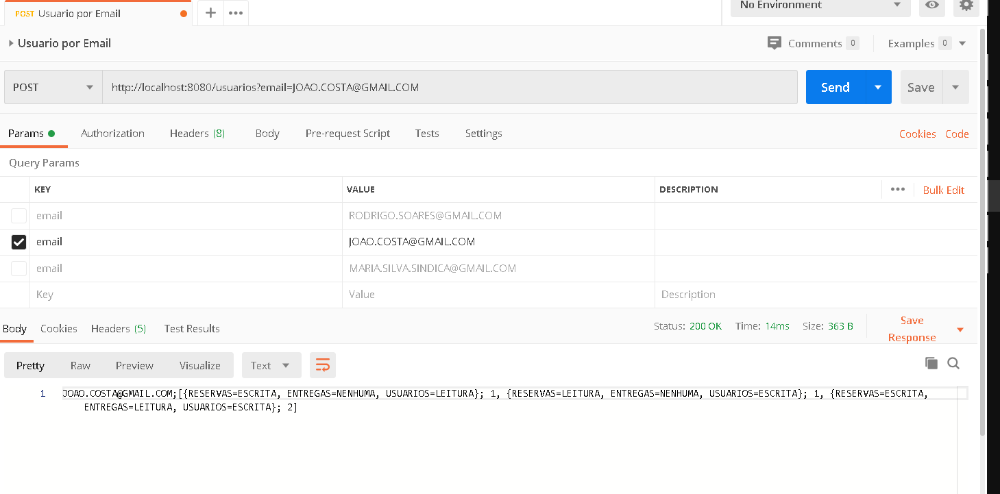

# Aplicação de Gerencimaneto de Condomínio
**By Fabio Marsiaj**

Nesse projeto a intenção é criar uma simples aplicação que gerencia usuários de um condomínio.
Um usuário tem um email, e um grupo, no qual pode ser:

    - Morador;
    - Síndico;
    
Cada um desses grupos possuem um ID próprio que se relaciona com o ID do condomínio em questão, pois,
um usuário pode ser morador num condomínio e síndico no mesmo e até em outros...

A aplicação lê os dados de um banco de dados em .txt localizado em **${USER_HOME}/data/in** (a aplicação cria o diretório para você, caso não existir...) e converte esses dados em entidades.
Ao converter esses dados, então a aplicação salva num banco de dado não relacional para posterior performance de busca.

Podemos utilizar a aplicação para buscar um usuário por EMAIL, que
nos retornará o seguinte output de exemplo:

INPUT:
```
    joao.costa@gmail.com
```
    
OUTPUT:
```
    1;[(Reservas,Escrita),(Entregas,Nenhuma),(Usuarios,Escrita)]
    2;[(Reservas,Escrita),(Entregas,Leitura),(Usuarios,Escrita)]
```

Observe que dependendo do tipo de grupo, as permissões para _**RESERVAS**_, **_ENTREGAS_** e _**USUARIOS**_ são diferentes.
    
## Summary

  - [Tecnologias](#tecnologias)
  - [Requisitos](#requisitos)
  - [Requisições HTTP pelo Postman](#requisies-http-pelo-postman)
  - [Rodando a Aplicação](#rodando-a-aplicacao)
  - [Autor](#autor)
  
  ## Tecnologias
  
   Para este projeto criei a aplicação com Spring Boot Web e MongoDB para persistência.
   
   Escolhi fazer um projeto web API pois a aplicação seria mais próxima de um possível uso real.
   Uma outra aplicação poderia chamar este serviço para obter dados dos usuários e disponibilizar numa tela, por exemplo.
   
   Ou seja, a forma de fazer o input e obter o output é através do POSTMAN.

  ## Requisitos
  
  - [Git](https://git-scm.com/)
  - [MongoDB](https://www.mongodb.com/download-center)
  - [JDK8](https://www.oracle.com/java/technologies/javase-jdk8-downloads.html)
  
  ## Requisições HTTP pelo Postman
  
   Como o input deve ser uma String, não há nenhum problema. Veja a imagem a seguir para
   fazer uma requisição para o serviço:
   
   
   
   Como mostrado acima, o output também está como uma String no formato esperado.
   
   ## Rodando a Aplicação
   
   Clone o projeto de https://github.com/fabioqmarsiaj/condominium-residents
   
   Após siga os seguinte passos no terminal:
```
$cd ~/condominium-residents
$./gradlew clean build
$cd /build
$cd /libs
$java -jar condominium-residents-0.0.1-SNAPSHOT.jar
```

Caso esteja num Windows, baixe o PowerShell para poder buildar da mesma forma :)
   

   ## Autor
   
   **Fabio Quinto Marsiaj** -  [GitHub](https://github.com/fabioqmarsiaj)
   
   <a href="https://github.com/fabioqmarsiaj">
        
  </a>
  
